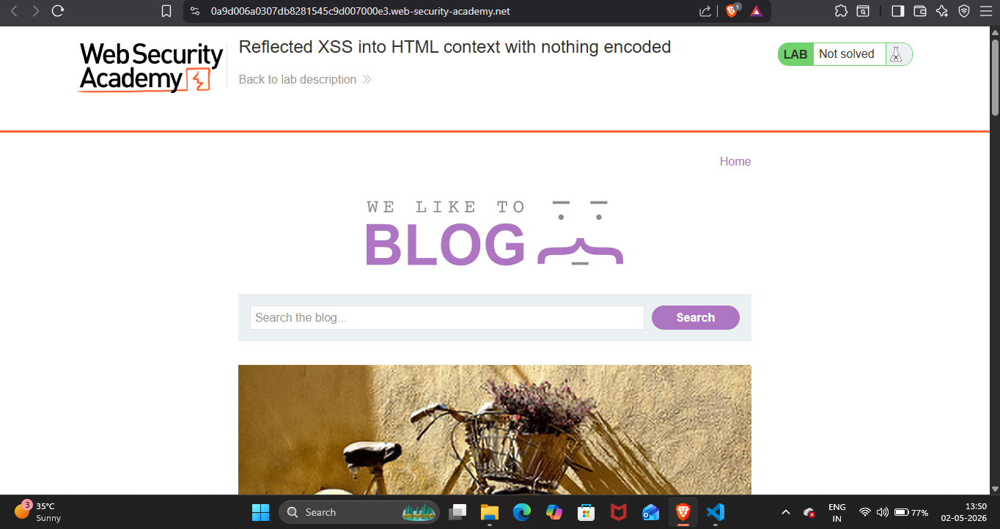
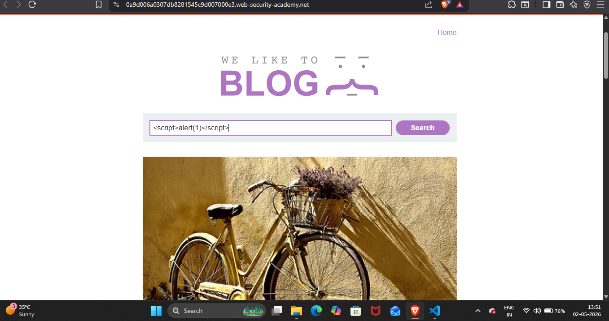
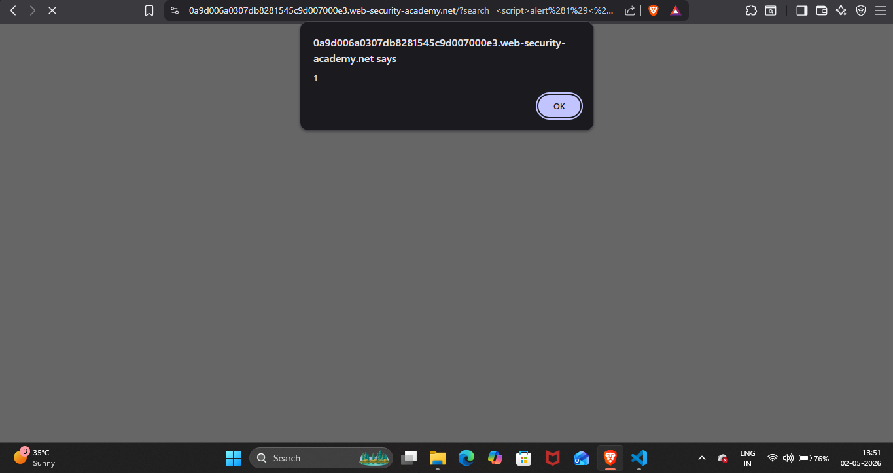
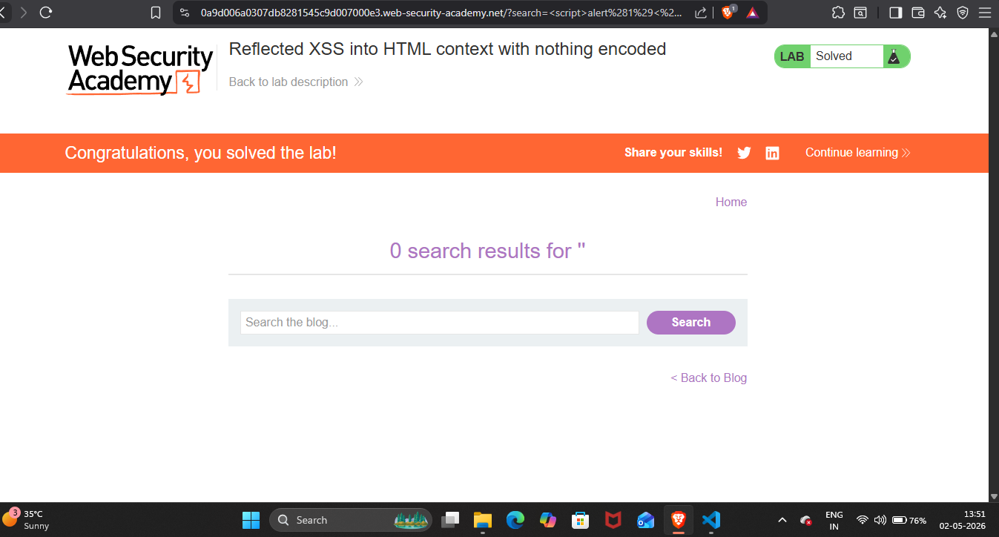

## Lab Write-Up: [Reflected XSS into HTML context with nothing encoded]

##  Lab Overview

* Platform-PortSwigger Web Security AcademyLab
* NAME-[Reflected XSS into HTML context with nothing encoded]
* Category[XSS]
* Difficulty[Apprentice]
* Date Completed[02-05-2026]
* Author[NAMAN MADAAN]

## Objective

This lab contains a simple reflected cross-site scripting vulnerability in the search functionality.my goal is to perform a cross-site scripting attack that calls the alert function

## References/Concepts used  

**Vulnerability**: [There is a vulmerability of  Reflected XSS]
**Tools Used**: [brave browser]
**Referenced used**: [Portswigger web security academy XSS: Notes ]

## Reconnaissance & Analysis

There is a site of where there are different blogs and there is a search bar to search for any blog in which i analyse that maybe in this search bar there is a possibility that this website is vulnerable to reflected xss 

## Exploitation Steps

 

In this after analysing i tried a html script with a alert in it.

 

## Proof of Completion

This alert pop up shows that this site is vulnerable to reflected xss as whatever code we are writing in the search bar it simply pop up in a site 

 

## Mitigation & Remediation

we can  prevent this vulnerability, the application must use  context-aware HTML output encoding. Before reflecting any user-controllable data on the webpage, special characters (like < and >) should be converted into their safe HTML entities (like &lt; and &gt;) so the browser treats them strictly as plain text, not executable code