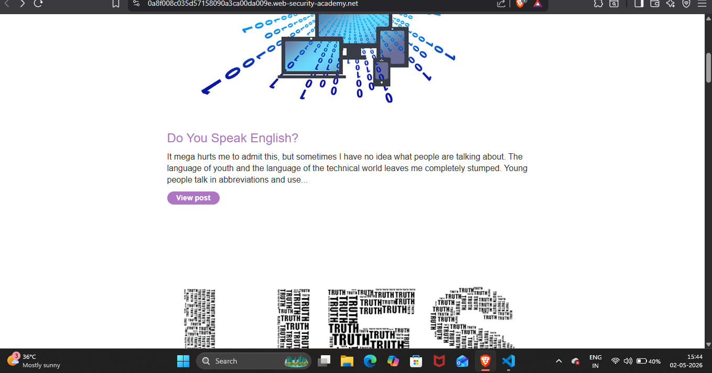
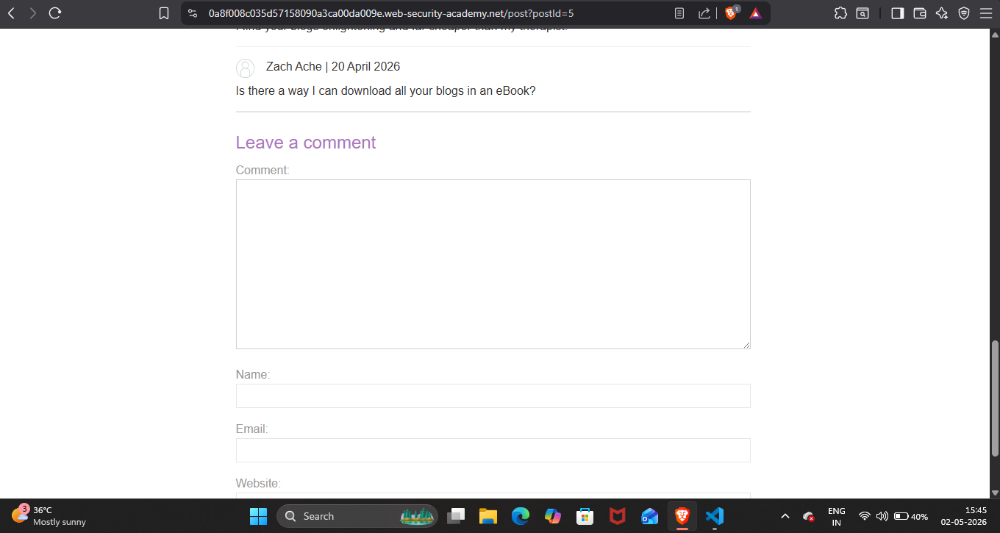
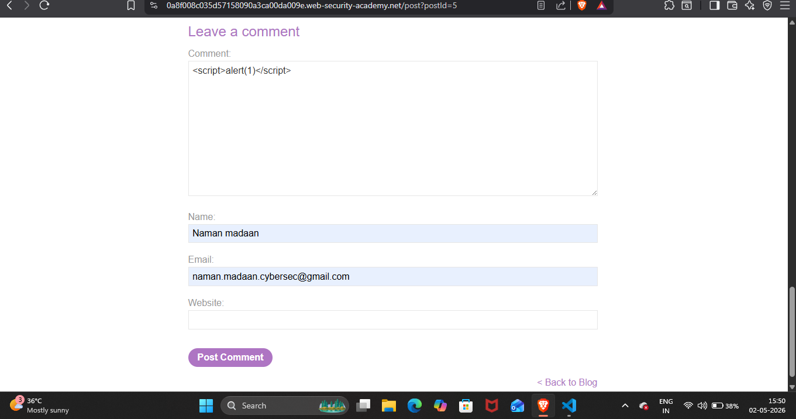
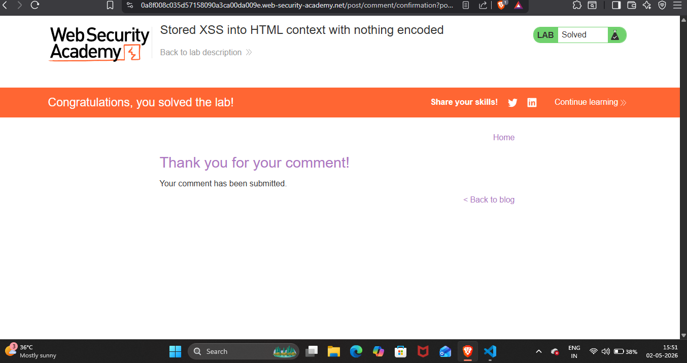

## Lab Write-Up: [Stored XSS into HTML context with nothing encoded]

##  Lab Overview

* Platform-PortSwigger Web Security AcademyLab
* Name-[Stored XSS into HTML context with nothing encoded]
* Category [XSS]
* Difficulty[Apprentice]
* Date Completed[02-05-2026]
* Author[NAMAN MADAAN]

## Objective

This lab contains a stored cross-site scripting vulnerability in the comment functionality.My goal is to submit a comment that calls the alert function when the blog post is viewed.

## References/Concepts used  

**Vulnerability**: [There is a vulmerability of  Stored XSS]
**Tools Used**: [brave browser]
**Referenced used**: [Portswigger web security academy XSS: Notes ]

## Reconnaissance & Analysis

During the initial recon I noticed there is a blog called Do you speak english?
 

I started analysing this article and found a comment section in which we can give some opinions about article 
  

## Exploitation Steps

Upon discovering the comment input field, I injected malicious javascript in it to see the website is vulnerable or not.  

After finding out the vulnerability i injected my payload ``

 

## Proof of Completion

As the site is vulnerable the malicious code is stored in the database of this website 

## Mitigation & Remediation

To fix this Stored XSS vulnerability, the developer needs to use HTML output encoding. Whenever user data is pulled from the database and displayed on the webpage, special characters like < and > should be converted into their safe HTML entities (like `&lt;` and `&gt;`). This ensures the browser just reads the input as normal text, instead of executing it as actual code.