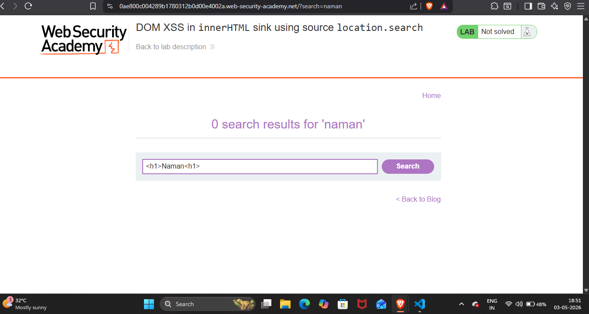
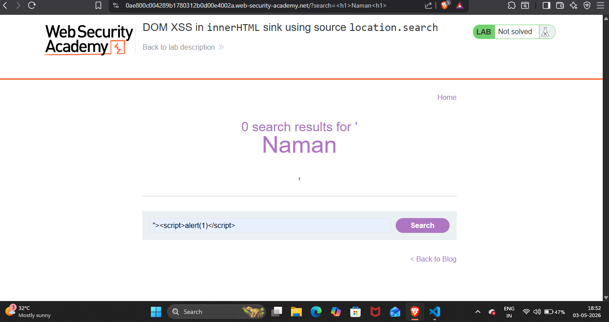
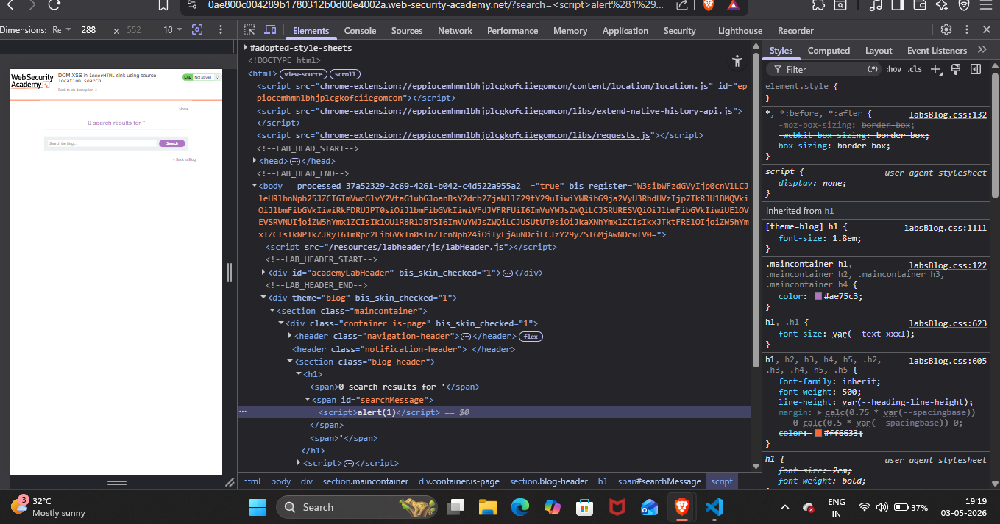
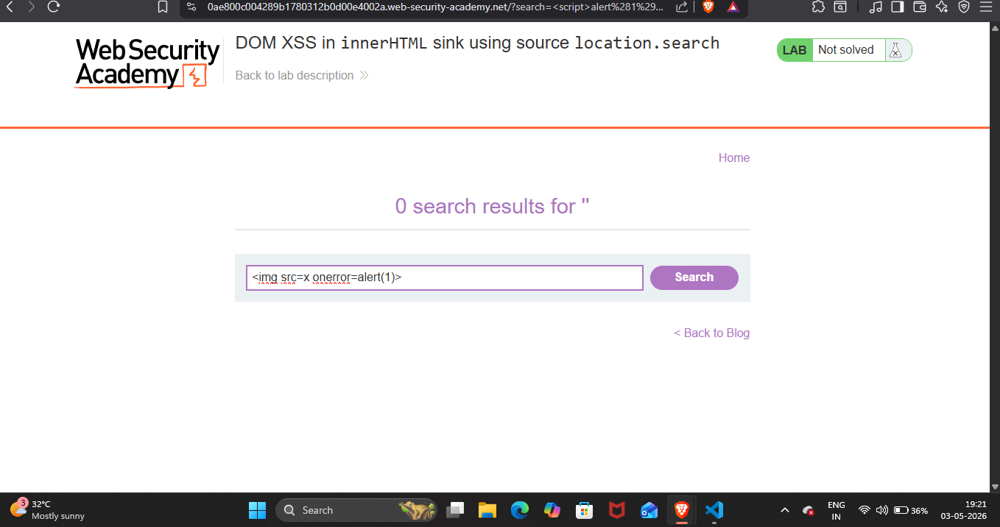
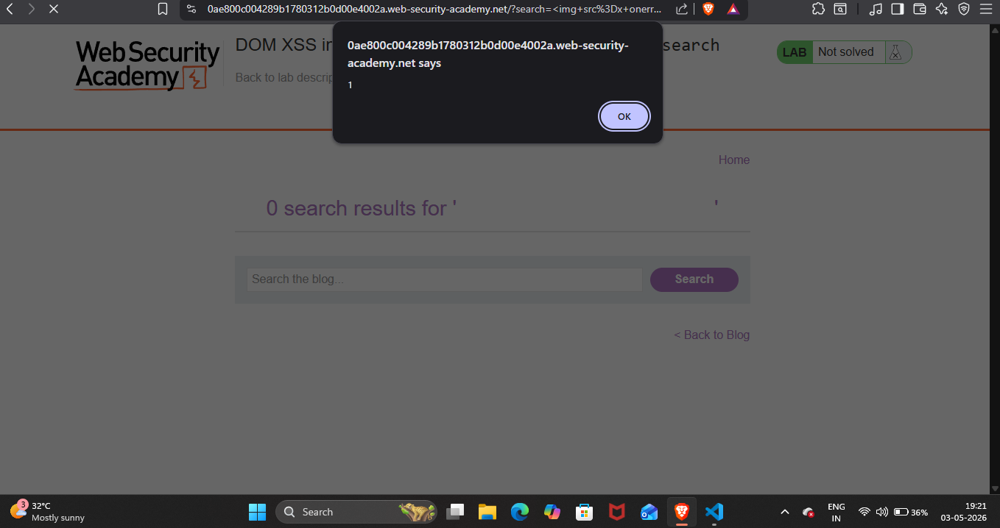

## Lab Write-Up: [DOM XSS in innerHTML sink using source location.search]

##  Lab Overview

* Platform-PortSwigger Web Security AcademyLab
* Name-[DOM XSS in innerHTML sink using source location.search]
* Category [XSS]
* Difficulty[Apprentice]
* Date Completed[03-05-2026]
* Author[NAMAN MADAAN]
    
## Objective

This lab contains a DOM-based cross-site scripting vulnerability in the search blog functionality. It uses an innerHTML assignment, which changes the HTML contents of a div element, using data from location.search.My goal is to perform a cross-site scripting attack that calls the alert function

## References/Concepts used  

**Vulnerability**: [There is a vulmerability of  DOM XSS]
**Tools Used**:[Browser Developer Tools (Brave)]
**Referenced used**: [Portswigger web security academy XSS: Notes,]

## Reconnaissance & Analysis

I started with analysing website properly.

 

I used `<hi>Naman<hi>` payload to discover is this website is vulnerable.It shows My name in capital letters which proves that this website is executing my html code.

 

## Exploitation Steps

I injected `` payload.

I observed that In DevTools ``payload is injected as It is However,It was not executing. 

Then I realised that modern browsers block `<script>` tag.To bypass this restriction I injected another payload ``

 

## Proof of Completion

This pop up shows that My payload worked sucessfully.

Hence,I solved this lab.

 

## Mitigation & Remediation

To prevent this DOM XSS vulnerability, the developer must avoid using the innerHTML sink, as it parses input as raw HTML. Instead, they should use safer alternatives like textContent or innerText, which treat the user input strictly as plain text, neutralizing any malicious tags. If innerHTML is absolutely necessary, the input must be strictly sanitized using a trusted library like DOMPurify before assignment.