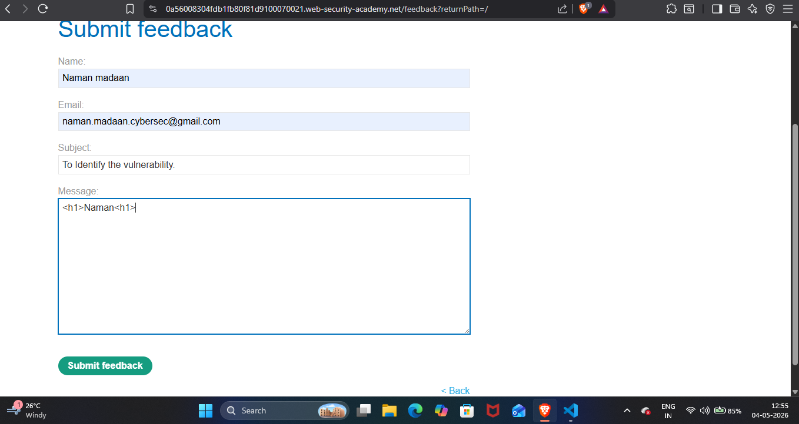
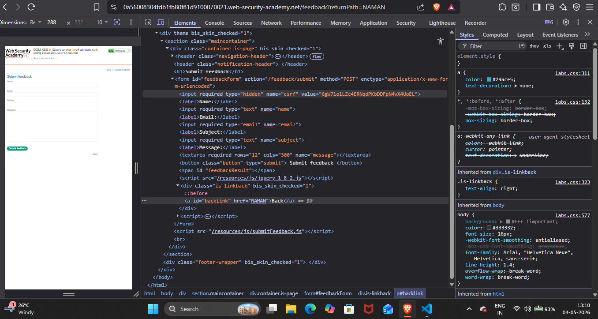
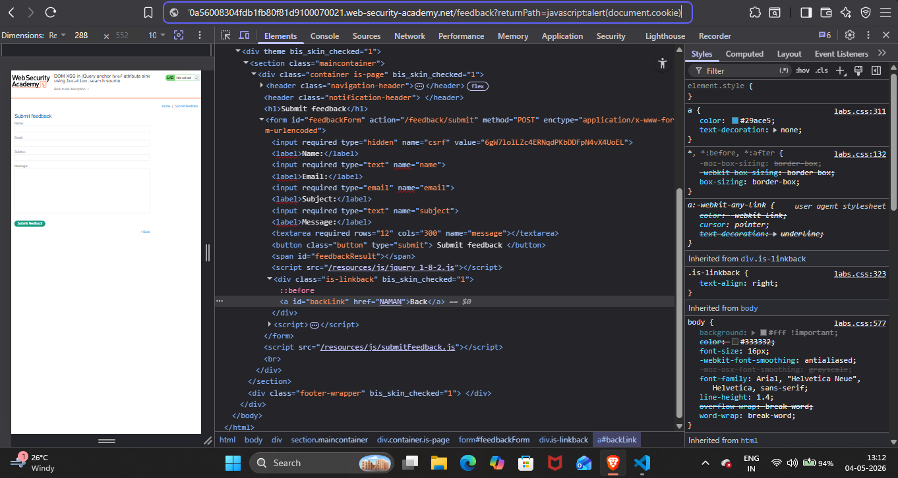
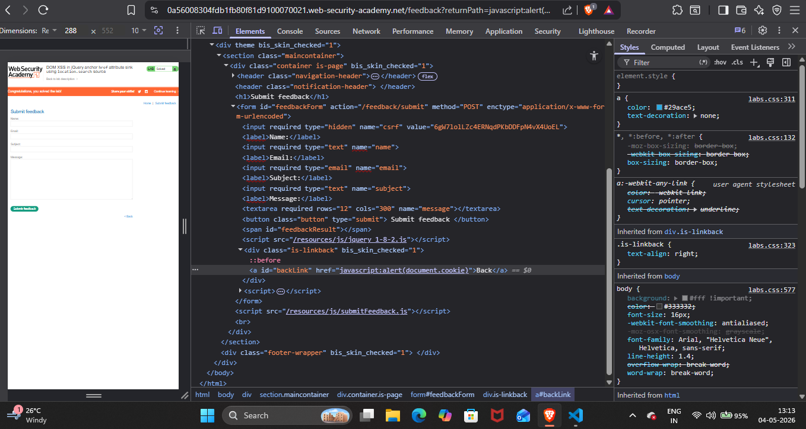
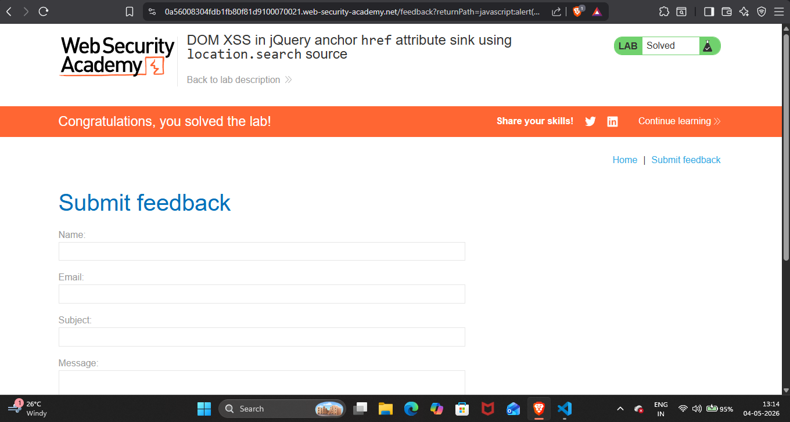

## Lab Write-Up: [DOM XSS in jQuery anchor href attribute sink using location.search source]

##  Lab Overview

* Platform-PortSwigger Web Security AcademyLab
* Name-[DOM XSS in jQuery anchor href attribute sink using location.search source]
* Category [XSS]
* Difficulty[Apprentice]
* Date Completed[04-05-2026]
* Author[NAMAN MADAAN]
    
## Objective

This lab contains a DOM-based cross-site scripting vulnerability in the submit feedback page. It uses the jQuery library's $ selector function to find an anchor element, and changes its href attribute using data from location.search.My goal is to make the "back" link alert document.cookie.

## References/Concepts used  

**Vulnerability**: [There is a vulnerability of  DOM XSS]
**Tools Used**:[Browser Developer Tools (Brave)]
**Referenced used**: [Portswigger web security academy XSS: Notes]

## Reconnaissance & Analysis
I started with analysing homepage of the website and I navigated to submit feedback form.

 

Then I started discovering what is going on ? Where I might inject my payload.I tried `<h1>Naman<h1>`in the feedback message form but this payload is not working as my expectations with It. 

  

## Exploitation Steps

I noticed url of the website and see return path where I inject my Name to see what happens and It was storing in Href attribute.Now I was sure my javascript payload will also store in this Href attribute and I can exploit It.

 

I injected javacript:alert(document.cookie) in the url to exploit the website.

 

## Proof of Completion

My payload of javascript sucessfully stored in Href attribute.

 

Therefore,I solved this lab.

 

## Mitigation & Remediation

To prevent this vulnerability, developers must avoid dynamically passing untrusted user input directly into the href attribute of anchor tags. If using a return path is necessary, the input must be strictly validated against a whitelist of safe, relative URLs (e.g., /home). Additionally, the application should strictly filter and block any input that contains the javascript: pseudo-protocol.
