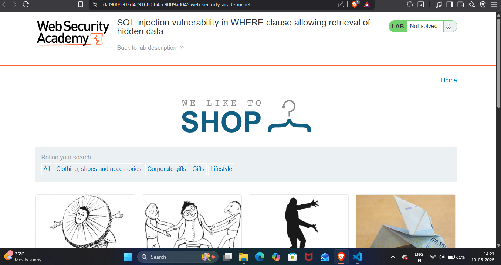
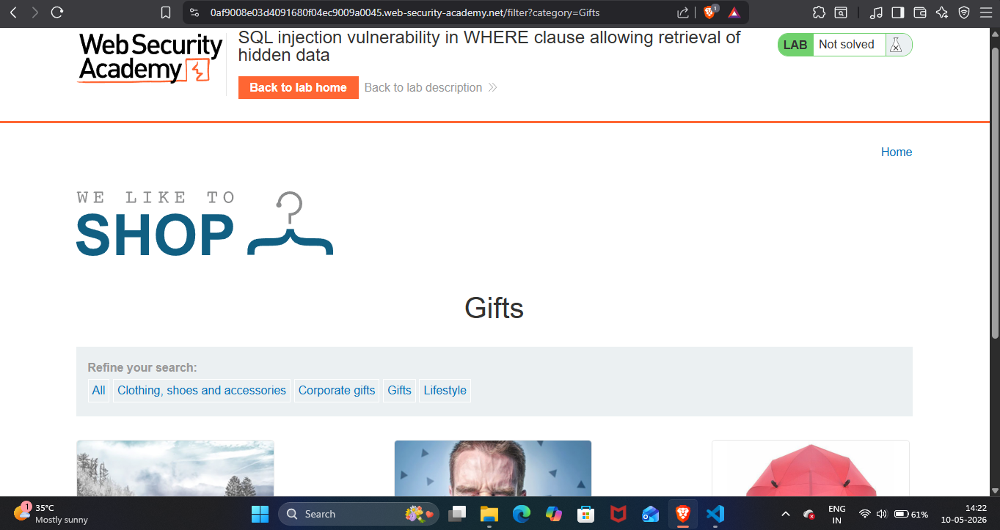
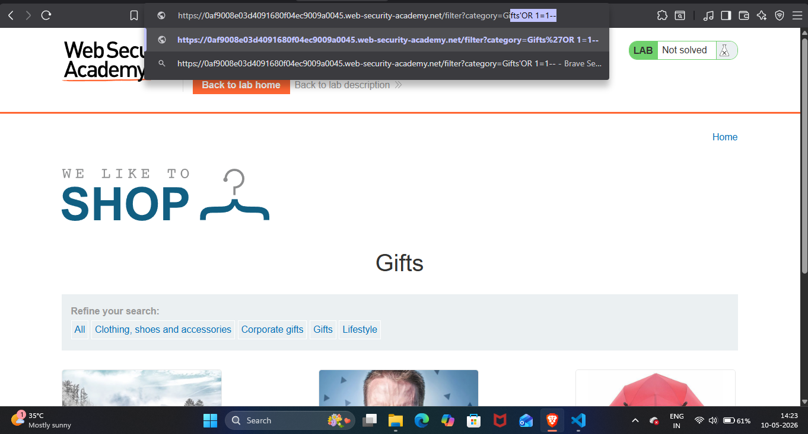
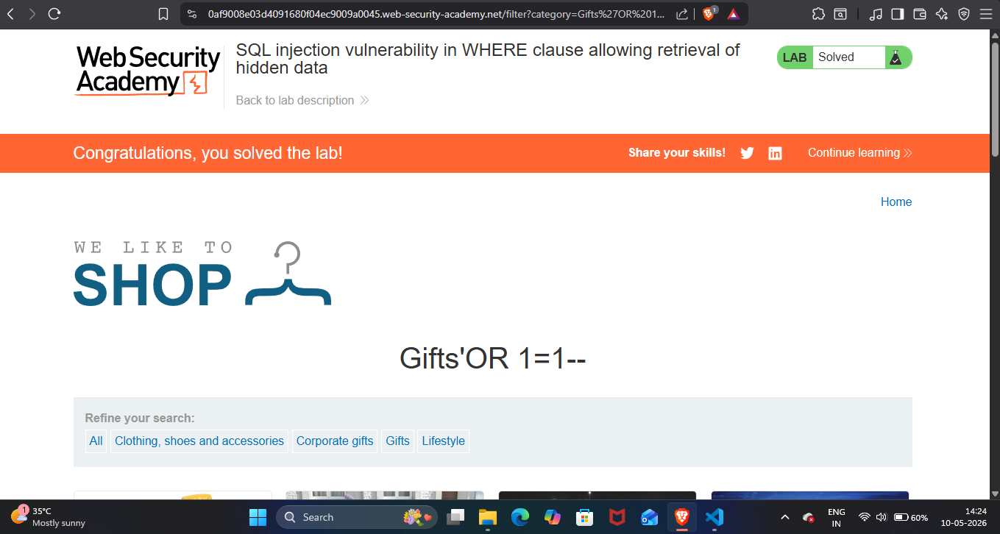

## Lab Write-Up: [SQL injection vulnerability in WHERE clause allowing retrieval of hidden data]

##  Lab Overview

* Platform-PortSwigger Web Security Academy Lab
* Name-[SQL injection vulnerability in WHERE clause allowing retrieval of hidden data ]
* Category [SQL]
* Difficulty[Apprentice]
* Date Completed[10-05-2026]
* Author[NAMAN MADAAN]
    
## Objective

This lab contains a SQL injection vulnerability in the product category filter. When the user selects a category, the application carries out a SQL query like the following:

SELECT * FROM products WHERE category = 'Gifts' AND released = 1
My goal is to, perform a SQL injection attack that causes the application to display one or more unreleased products.

## References/Concepts used  

**Vulnerability**: [There is a vulnerability of  SQL INJECTION]
**Tools Used**:[BRAVE Browser]
**References used**: [Portswigger web security academy SQL: Notes]

## Reconnaissance & Analysis
I did recon by analysing the website properly, and I analysed that there are different WHERE clause options like clothing, shoes, gifts, etc.

 

Then I went to the gifts option. There are only 3 gifts available that are released to the public, but according to my task, I have to see all gifts listed on this website.

 

## Exploitation Steps

I tried single quote ' on url and there is internal server error showing from where i was sure that this website is vulnerable to sql injection.Then I injected my payload ' OR 1=1--.

 

## Proof of Completion

Therefore,after injecting my payload all the gifts items are  available the unreleased ones also.

 

Hence,I solved my lab.

 

## Mitigation & Remediation

To fix this issue, the website developers should use Parameterized Queries (or Prepared Statements) instead of directly mixing user input with the SQL code. By doing this, the database will treat my input strictly as normal text, not as an executable SQL command, and the injection will fail.