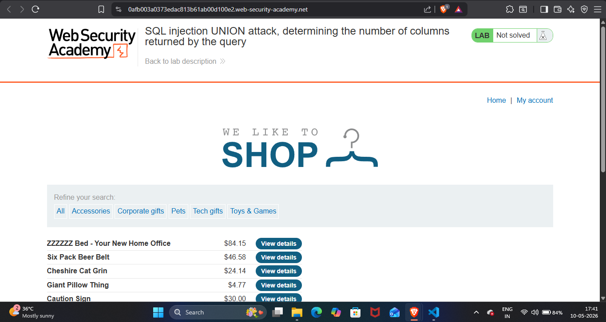
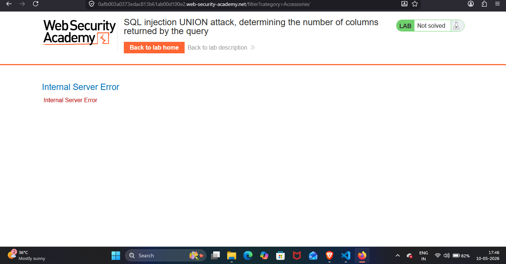
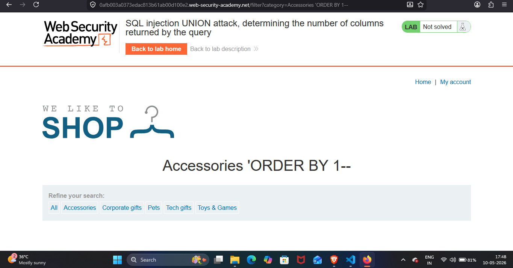
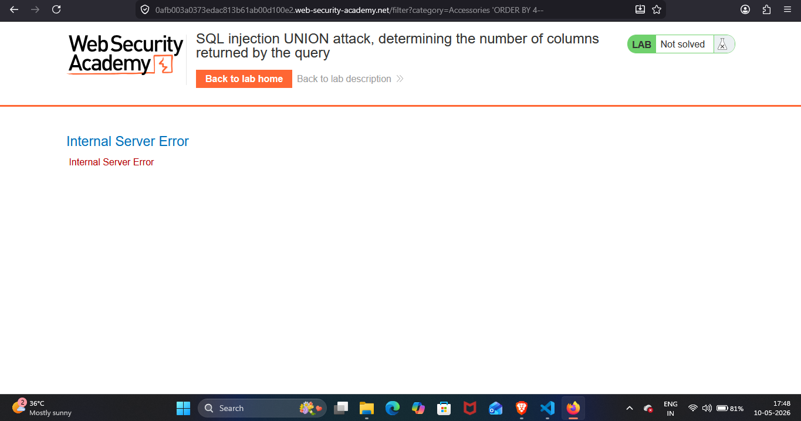
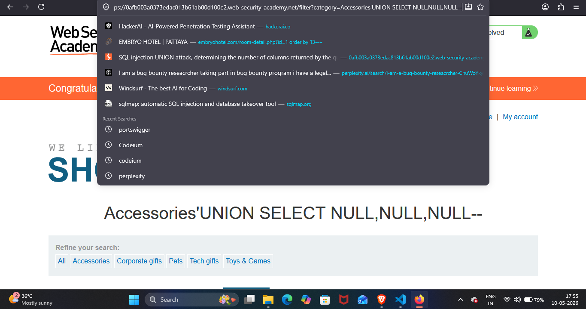
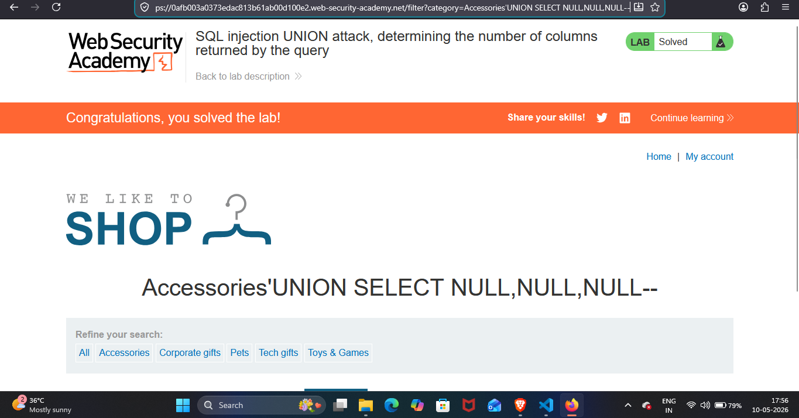

## Lab Write-Up: [SQL injection UNION attack, determining the number of columns returned by the query]

##  Lab Overview

* Platform-PortSwigger Web Security Academy Lab
* Name-[SQL injection UNION attack, determining the number of columns returned by the query]
* Category [SQL]
* Difficulty[PRACTITIONER]
* Date Completed[10-05-2026]
* Author[NAMAN MADAAN]
    
## Objective

This lab contains a SQL injection vulnerability in the product category filter. The results from the query are returned in the application's response, so you can use a UNION attack to retrieve data from other tables. The first step of such an attack is to determine the number of columns that are being returned by the query. You will then use this technique in subsequent labs to construct the full attack.

My goal is to,determine the number of columns returned by the query by performing a SQL injection UNION attack that returns an additional row containing null values.

## References/Concepts used  

**Vulnerability**: [There is a vulnerability of  SQL INJECTION]
**Tools Used**:[FIREFOX Browser]
**References used**: [Portswigger web security academy SQL: Notes]

## Reconnaissance & Analysis

I started by analysing the website page thoroughly.There are different category options listed like accessories,gifts,pets etc.

I then navigated to accessories section and I injected single quote (') in the URL parameter to check whether the website is vulnerable to SQL injection.

 

Next, I wanted to confirm exactly how many columns the backend query was returning. I started testing this by injecting the payload ' ORDER BY 1--.

 

The website loaded normally. I repeated this step, incrementing the number until I tested ' ORDER BY 4--, which resulted in an HTTP 500 Internal Server Error. This confirmed that there are exactly 3 columns, as the website loaded fine up to my ' ORDER BY 3-- payload.

## Exploitation Steps

At this point, I was sure there were 3 columns. I then injected my final payload: ' UNION SELECT NULL, NULL, NULL--

 

 

## Proof of Completion

By successfully matching the column count with NULL values, the database executed the query without errors, and this is how I successfully solved the lab.

 

## Mitigation & Remediation

To prevent UNION-based SQL injection, developers should avoid directly concatenating user input into database queries. Instead, implement Parameterized Queries (Prepared Statements) for all database interactions. Additionally, avoid displaying raw database error messages or directly mapping database columns to the frontend response without proper abstraction.

