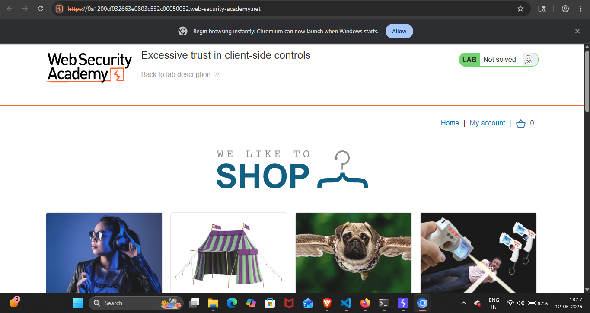
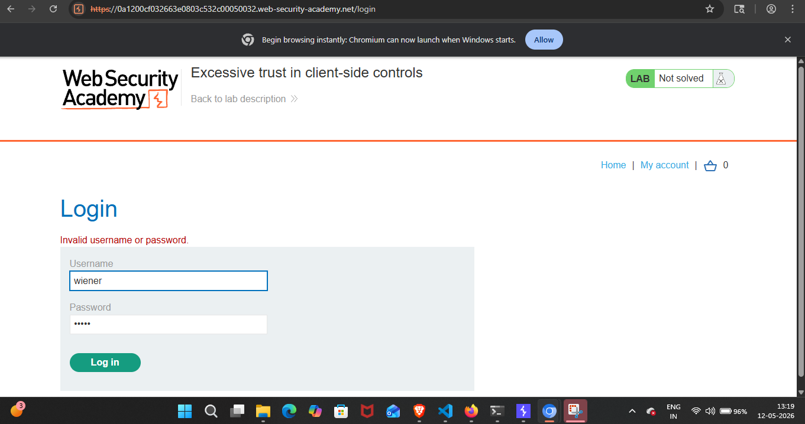
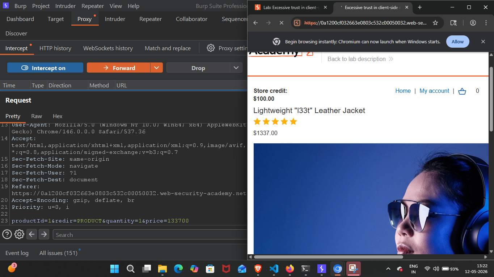
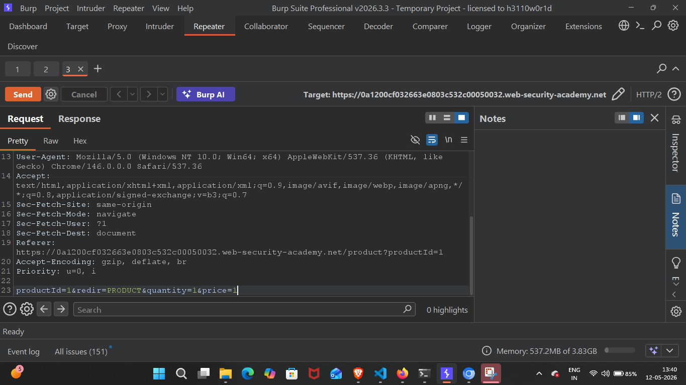
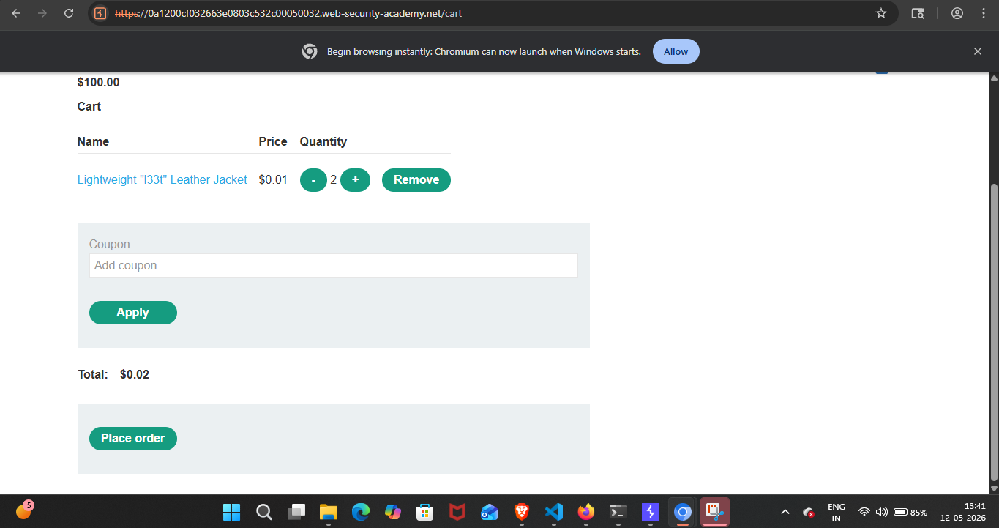
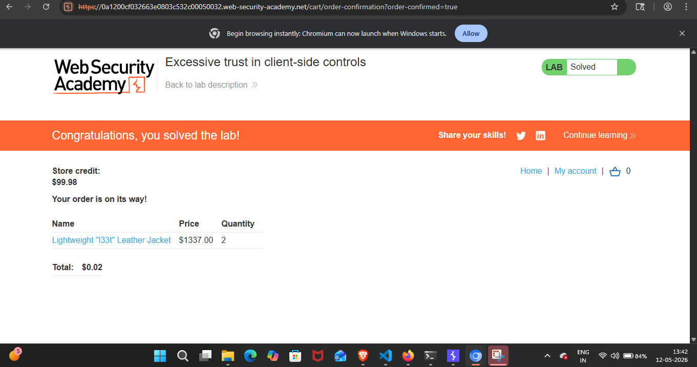

## Lab Write-Up: [Excessive trust in client-side controls]

##  Lab Overview

* Platform-PortSwigger Web Security Academy Lab
* Name-[Excessive trust in client-side controls]
* Category [LOGIC FLOW]
* Difficulty[APPRENTICE]
* Date Completed[11-05-2026]
* Author[NAMAN MADAAN]
    
## Objective

This lab doesn't adequately validate user input. You can exploit a logic flaw in its purchasing workflow to buy items for an unintended price. My goal is to buy a "Lightweight l33t leather jacket".
## References/Concepts used  

**Vulnerability**: [There is a vulnerability of LOGIC FLOW]
**Tools Used**:[BURP SUITE PRO,CHROMIUM Browser]
**References used**: [Portswigger web security academy Business logic vulnerabilities: Notes]

## Reconnaissance & Analysis

I started by analyzing the website thoroughly. I noticed the "My Account" option for authentication and also observed the original price of the "Lightweight l33t leather jacket".

 

Then, I logged into my account using the provided credentials (username: wiener, password: peter)

 

## Exploitation Steps

I realized that I only had $100 in store credit, but my goal was to buy a leather jacket priced at $1337. I used Burp Suite Professional to intercept the POST request triggered when adding the jacket to the cart.

 

I sent this request to the Repeater tab in Burp Suite to tamper with the price parameter. I modified the price to $0.01 and forwarded the manipulated request to the server.

 

After manipulating the POST request, I refreshed my Chromium browser. The price of the jacket in my cart had updated successfully, allowing me to easily place the order.

 
 

## Proof of Completion

By successfully manipulating the client-side price parameter, I solved this lab.

  

## Mitigation & Remediation

To fix this flaw, the application needs to stop relying on client-side inputs for critical business logic. If a user adds an item to their cart, the server should only accept the 'Product ID' and 'Quantity'. Relying on a hidden price field in the browser is dangerous. The backend must always verify and fetch the real price straight from the database before calculating the transaction total.