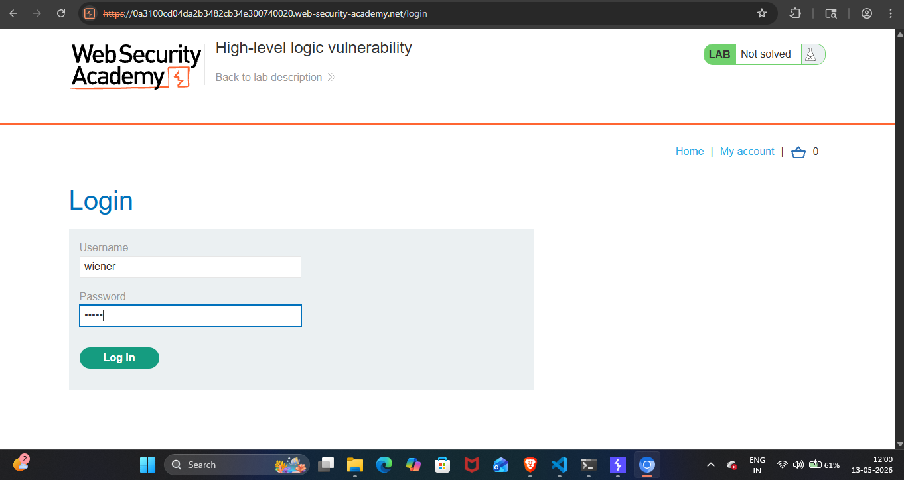
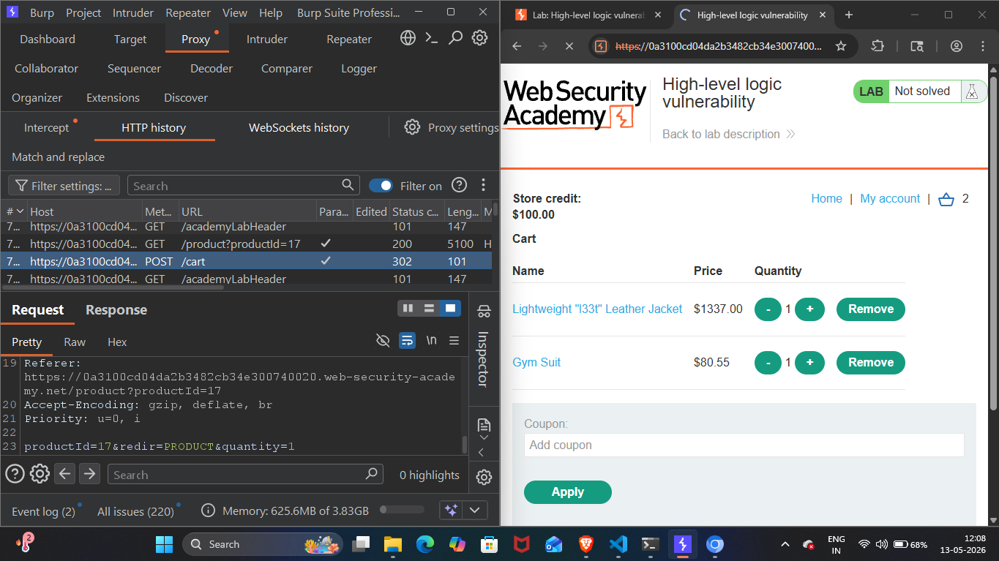
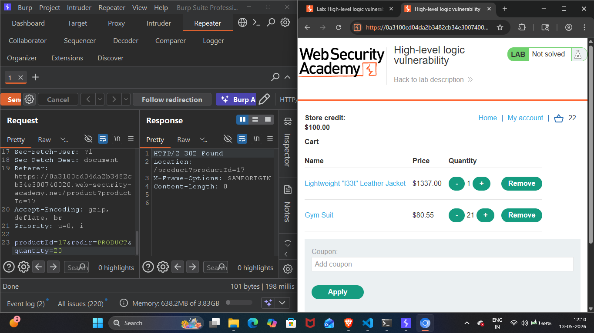
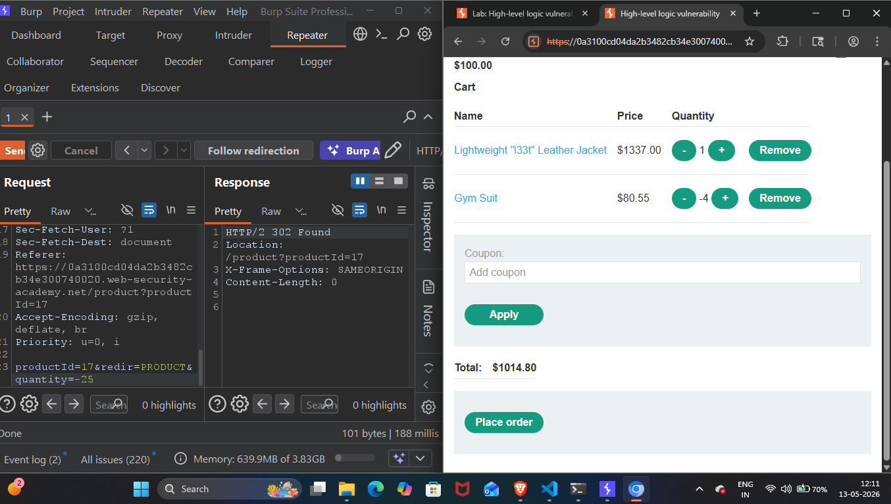
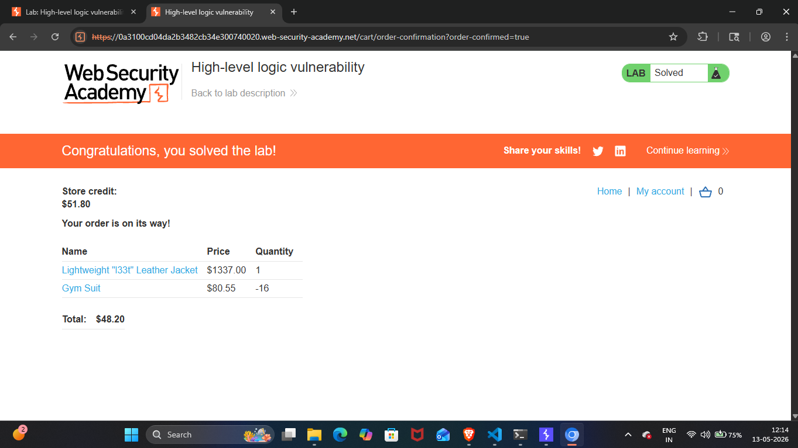

## Lab Write-Up: [High-level logic vulnerability]

##  Lab Overview

* Platform-PortSwigger Web Security Academy Lab
* Name-[High-level logic vulnerability]
* Category [LOGIC FLOW]
* Difficulty[APPRENTICE]
* Date Completed[12-05-2026]
* Author[NAMAN MADAAN]
    
## Objective

This lab doesn't adequately validate user input. You can exploit a logic flaw in its purchasing workflow to buy items for an unintended price. My goal is to buy a "Lightweight l33t leather jacket".

## References/Concepts used  

**Vulnerability**: [There is a vulnerability of LOGIC FLOW]
**Tools Used**:[BURP SUITE PRO,CHROMIUM Browser]
**References used**: [Portswigger web security academy Business logic vulnerabilities: Notes]

## Reconnaissance & Analysis

I started by analyzing the website thoroughly. I noticed the 'My Account' option for authentication and also observed the prices of the multiple products available.

Then, I logged in using the provided credentials (username: wiener and password: peter).

 

## Exploitation Steps

Next, I added 2 items to my cart and went to the HTTP History tab in Burp Suite Professional to capture the POST request generated while adding these products.

 

After capturing the POST request for the product 'Gym Suit', I tried to change the quantity parameter to explore how the server handles it. I noticed the quantity and the total price changed accordingly upon refreshing, which confirmed that the website was vulnerable.

 

Then, I tried changing the quantity to -25 and observed that the website decreased the final total price because it accepted the negative quantity value.

 

I tampered with the quantity of the 'Gym Suit' multiple times, adjusting it to -16, as my primary goal was to buy the "Lightweight l33t leather jacket" within my budget of $100.

 

## Proof of Completion

Therefore, after tampering with the quantity parameter, I successfully brought the total bill down to $48.20, landing well within my budget, and placed the order. This is how I successfully solved the lab.

 

## Mitigation & Remediation

The server blindly calculated the total without checking if a negative quantity makes real-world sense. To fix this, developers MUST add a strict backend check to ensure quantity > 0 before doing any math. Using 'unsigned integers' for quantity variables is the best defense, as they mathematically cannot store negative numbers.