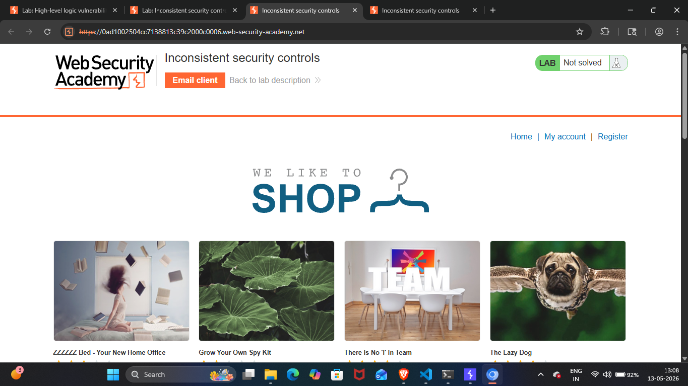
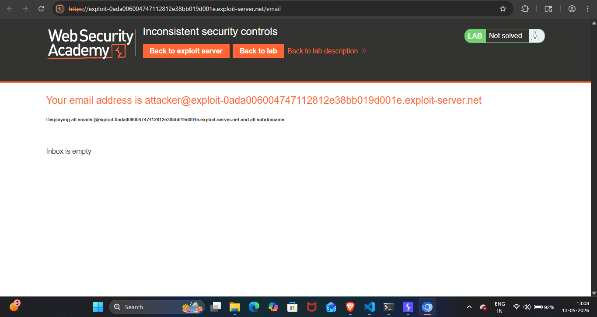
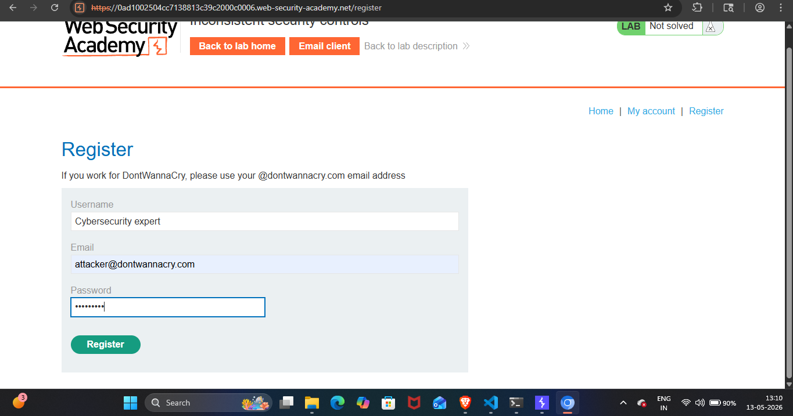
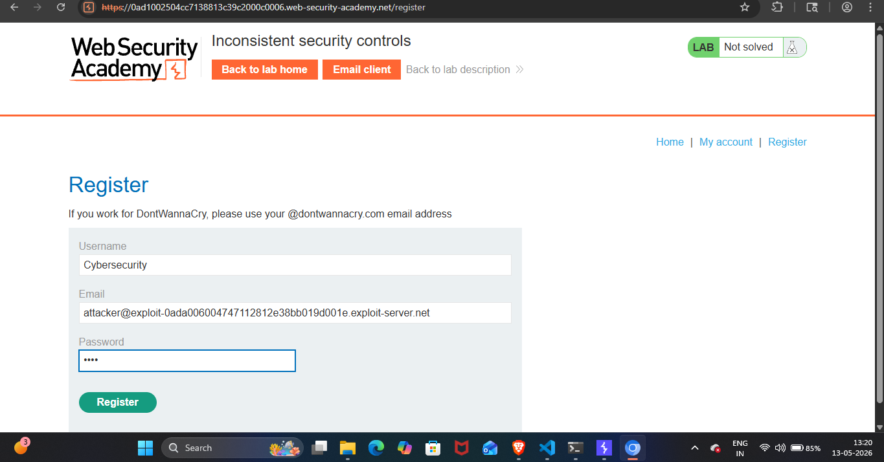
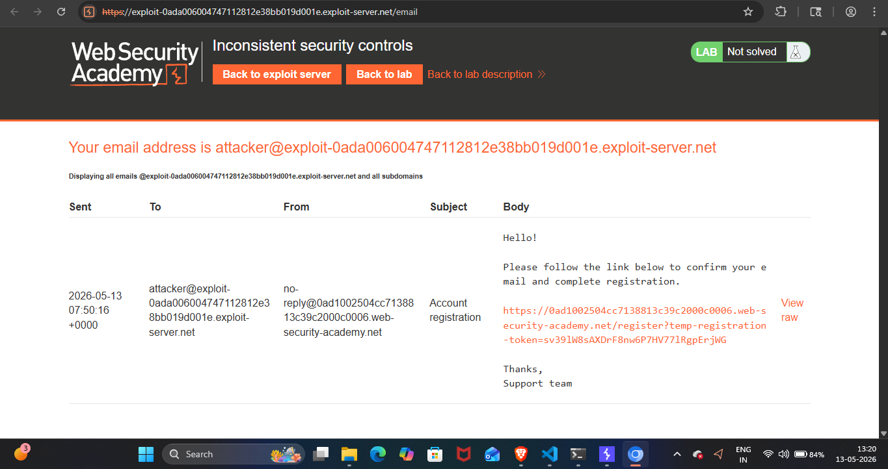
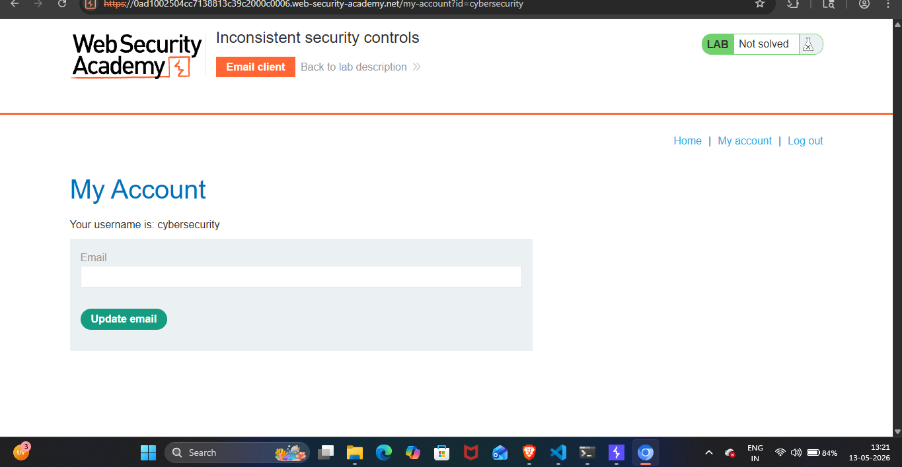
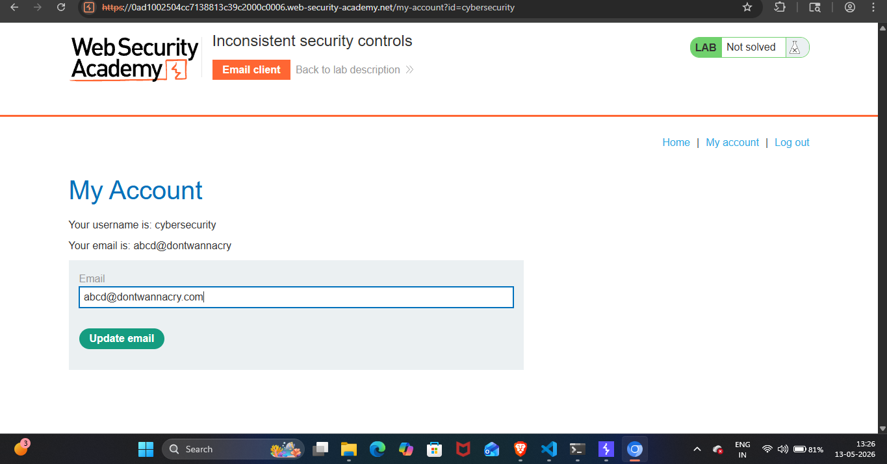
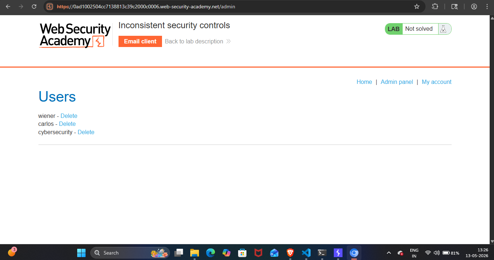
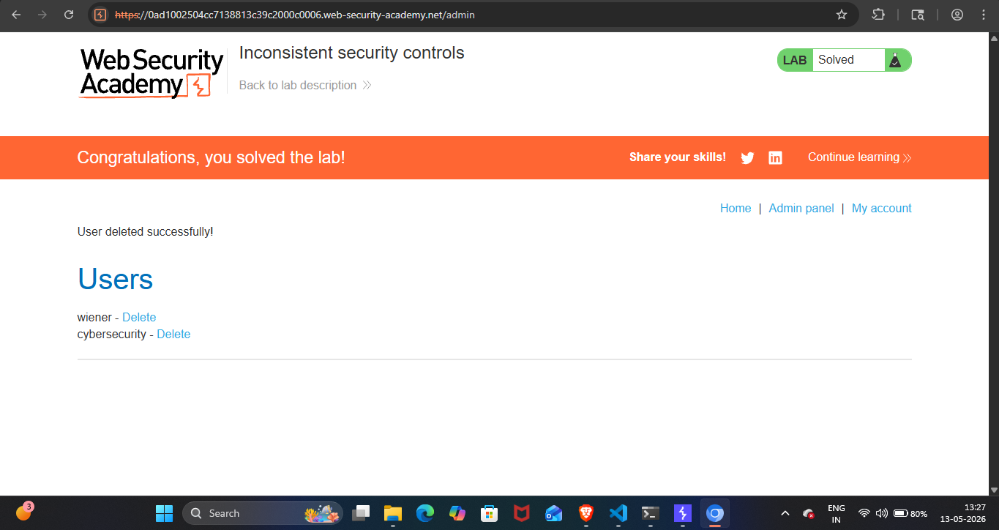

## Lab Write-Up: [Inconsistent security controls]

##  Lab Overview

* Platform-PortSwigger Web Security Academy Lab
* Name-[Inconsistent security controls]
* Category [LOGIC FLOW]
* Difficulty[APPRENTICE]
* Date Completed[12-05-2026]
* Author[NAMAN MADAAN]
    
## Objective

This lab's flawed logic allows arbitrary users to access administrative functionality that should only be available to company employees. My goal is to access the admin panel and delete the user carlos.

## References/Concepts used  

**Vulnerability**: [There is a vulnerability of LOGIC FLOW]
**Tools Used**:[BURP SUITE PRO,CHROMIUM Browser]
**References used**: [Portswigger web security academy Business logic vulnerabilities: Notes]

## Reconnaissance & Analysis

I started by analyzing the website thoroughly. I observed a 'Register' option, various listed products, and an 'Email client' tab.

 

I clicked on the 'Email client' tab to explore it and found a temporary email address provided for registration, along with an inbox for verification.

I went to the 'Register' page and noticed a message: "If you work for DontWannaCry, please use your @dontwannacry.com email address". I initially tried logging in with a fake employee email directly, but it failed. I realized I had to register as a normal user first.

 

## Exploitation Steps

I registered using the temporary email provided.

 

Then, I checked the email client inbox, clicked the registration link, and successfully authenticated myself.

 

After logging in, I navigated to the 'My Account' page and found an option to update my email.

To gain higher access, I updated my email to abcd@dontwannacry.com to spoof an employee account.
The application accepted the new employee email without asking for any verification.

 

Then, after logging in as an employee, I explored the admin panel, clicked on that option, and deleted the user carlos.

 

## Proof of Completion 

This is how I completed my lab.

 

## Mitigation & Remediation

The application strictly verifies emails during registration but completely fails to verify them during an email update. To fix this inconsistent logic, developers MUST enforce verification on all email changes. If a user updates their email, the new address must remain unverified and restricted until the user clicks a unique confirmation link sent to that specific new inbox.
