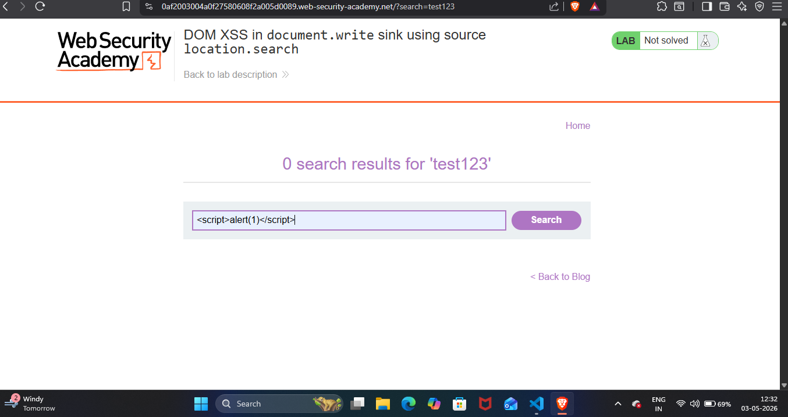
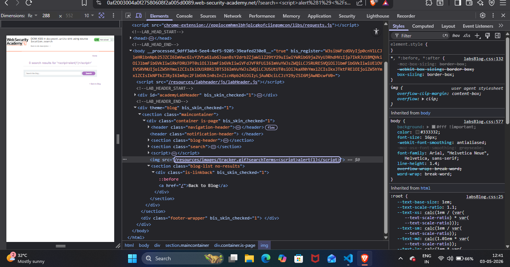
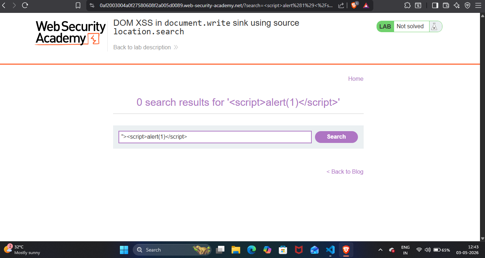
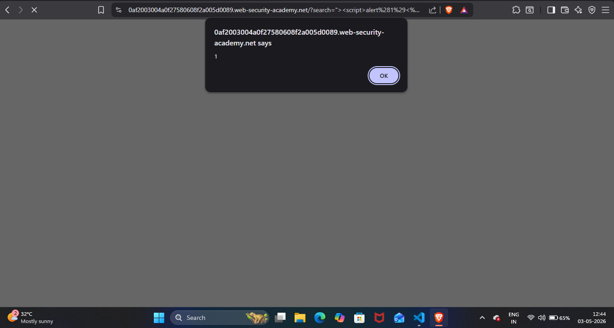
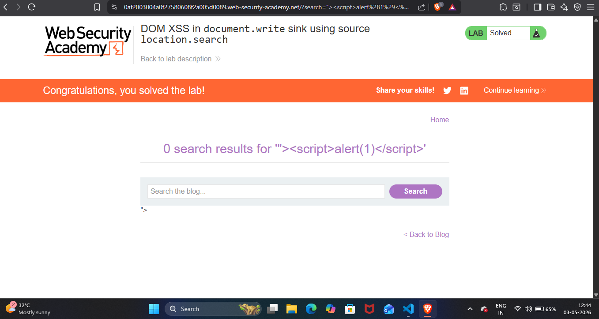

## Lab Write-Up: [DOM XSS in document.write sink using source location.search]

##  Lab Overview

* Platform-PortSwigger Web Security AcademyLab
* Name-[DOM XSS in document.write sink using source location.search]
* Category [XSS]
* Difficulty[Apprentice]
* Date Completed[03-05-2026]
* Author[NAMAN MADAAN]

## Objective
This lab contains a DOM-based cross-site scripting vulnerability in the search query tracking functionality. It uses the JavaScript document.write function, which writes data out to the page. The document.write function is called with data from location.search, which we can control using the website URL. My goal is to perform a cross-site scripting attack that calls the alert function

## References/Concepts used  

**Vulnerability**: [There is a vulmerability of  DOM XSS]
**Tools Used**: [Inspect option,brave browser]
**Referenced used**: [Portswigger web security academy XSS: Notes ]

## Reconnaissance & Analysis

I recon a website properly and starting analysing what is going on.

I injected my `script>alert(1)</script` payload and started discovering what result is being shown.

## Exploitation Steps
Then I used a inspect tool to discover what is happening with my alert payload.

 

I analyse that my payload is not working because there is a type of lock of img attribute.I break out the img attribute lock by inserting "> in front of my payload as It breaks out img attribute lock and My payload will work like a code 

 

## Proof of Completion

I finally got a pop up which shows that there is a vulnerability of DOM.

I solved my lab 

 

## Mitigation & Remediation

Developers should avoid using dangerous JavaScript functions like document.write(), which blindly execute user input as HTML code. To prevent this DOM XSS, they should use safer properties like textContent or innerText. These safe functions treat all user input strictly as plain text, making it impossible for injected scripts to run.
