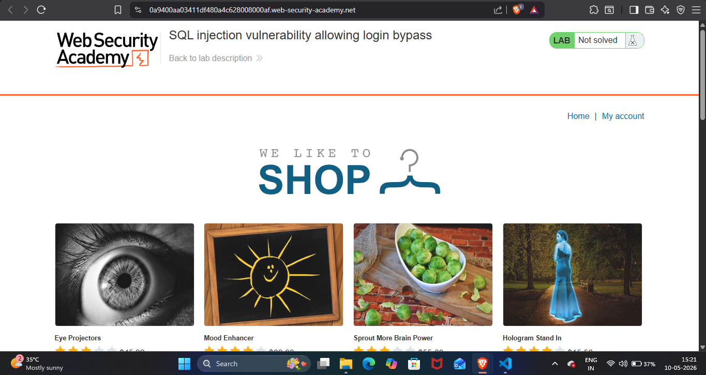
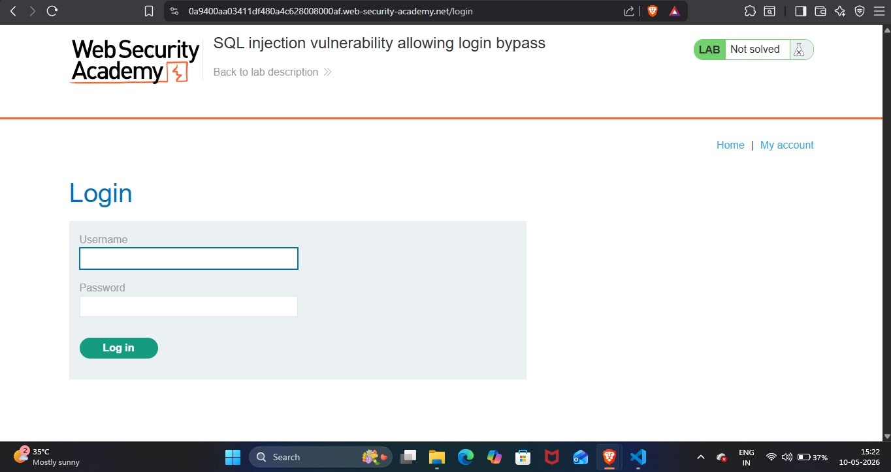
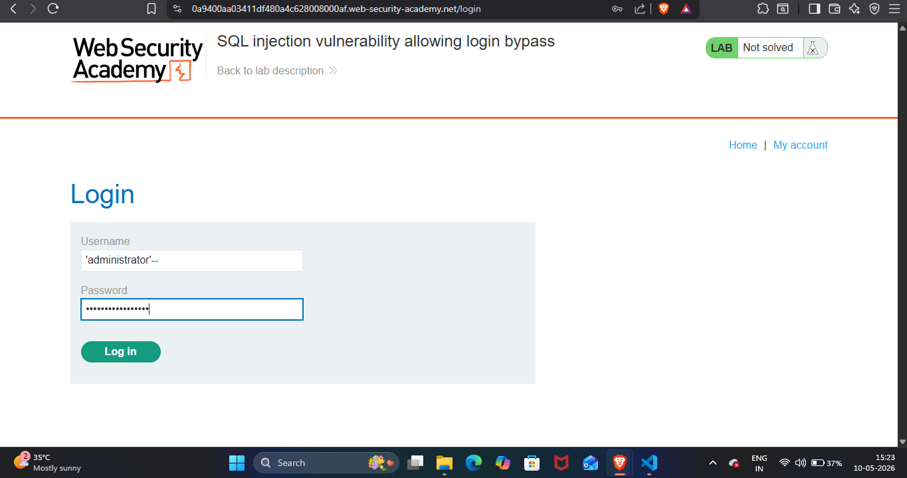
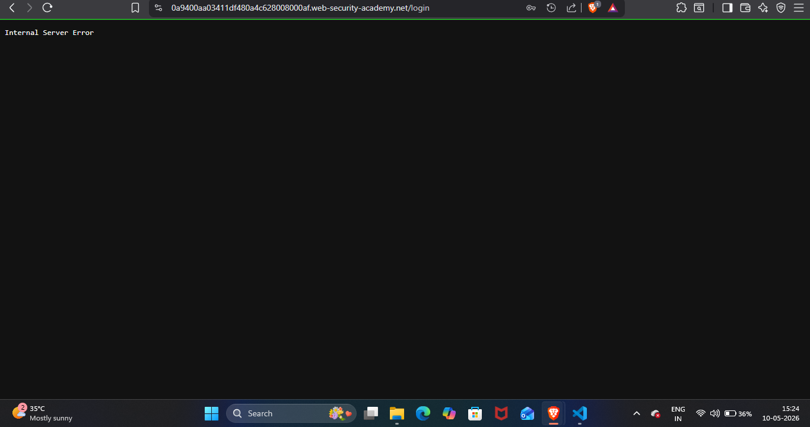
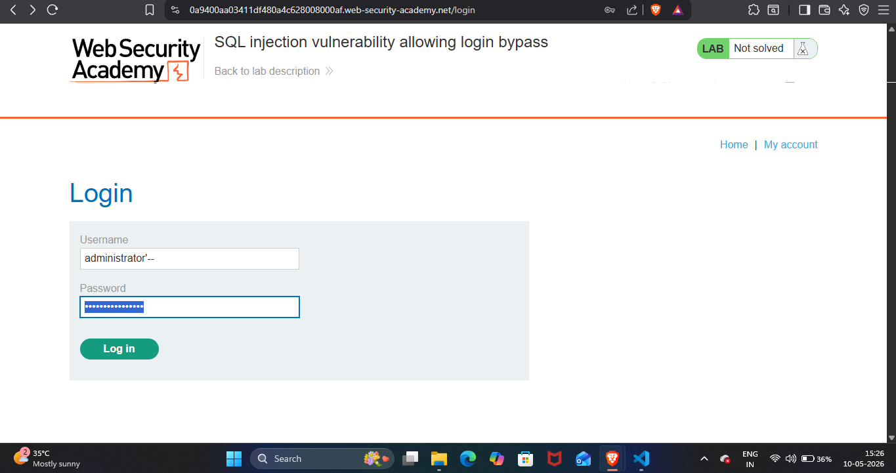
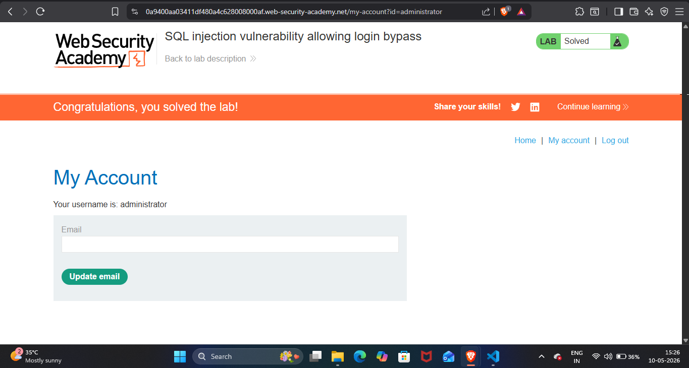

## Lab Write-Up: [SQL injection vulnerability allowing login bypass]

##  Lab Overview

* Platform-PortSwigger Web Security Academy Lab
* Name-[SQL injection vulnerability allowing login bypass]
* Category [SQL]
* Difficulty[Apprentice]
* Date Completed[10-05-2026]
* Author[NAMAN MADAAN]
    
## Objective

This lab contains a SQL injection vulnerability in the login function.
My goal is to, perform a SQL injection attack that logs in to the application as the administrator user.

## References/Concepts used  

**Vulnerability**: [There is a vulnerability of  SQL INJECTION]
**Tools Used**:[BRAVE Browser]
**References used**: [Portswigger web security academy SQL: Notes]

## Reconnaissance & Analysis

I started analysing this website properly and noticed the  'My Account' option.

I then navigated to the login page to analyse how authentication mechanism works. 

## Exploitation Steps

I started with injecting my first payload 'administrator'-- the website returned HTTP 500 internal server  error.

 

This shows that my payload was breaking backend SQl syntax,confirming this website is vulnerable to sql injection.

 

Then I realised that this website is already wrapping my input in single quote (').I adjusted my payload to adminstrator'-- in the username field and also include the same payload in  the password field.

 
 

## Proof of Completion

This is how I successfully bypassed the authentication and solved the lab.

  

## Mitigation & Remediation

To prevent authentication bypass via SQL injection, developers must use Parameterized Queries (Prepared Statements) for all database interactions. This ensures the database treats the username and password inputs strictly as literal string data, rendering malicious characters like quotes (') and comments (--) harmless.
